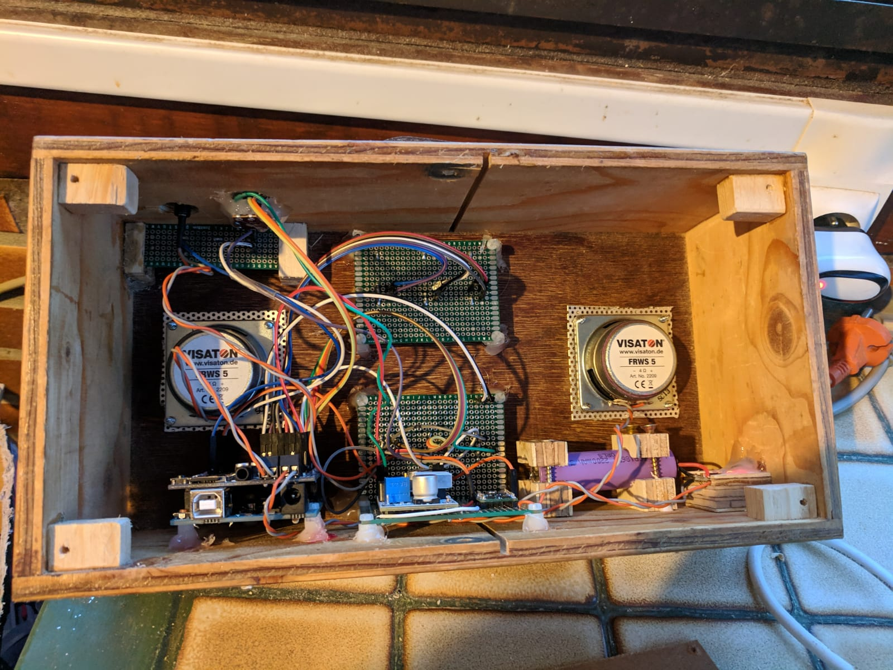

# Hoerbert Hack

Disclaimer: I am not a professional. This is project that needs some improvement but it works!

This project is DIY version of the [Hoerbert MP3 player](https://en.hoerbert.com/) for kids. It is heavily inspired by [Wooden Radio (MP3 Player for Children)](https://www.thingiverse.com/thing:1480525).

 before the power led was added

## Functionnality

* 12 dedicated buttons for mp3
* Next and Previous buttons for next or previous mp3
  * If you press on button 12, `track012.mp3` will be played, and if you press next, `track013.mp3` will be played
* After 4 minutes if nothing has been played turn off the radio

## Software

See [.ino file](hoerbert_hack.ino)

## Schema

## Components

- 1 x [LM2577 DC-DC VOLTAGE STEP-UP (BOOST) MODULE](https://www.velleman.eu/products/view/?id=435562)
- 1 x [1 A LITHIUM BATTERY CHARGING BOARD](https://www.velleman.eu/products/view/?id=435556)
- 14 x switchs
- 1 x 10k ohm variable resistor for volume
- 1 x [Mini Pushbutton Power Switch with Reverse Voltage Protection, LV](https://www.pololu.com/product/2808)
- 1 x [MP3 shield](https://www.adafruit.com/product/1788)
- 1 x Arduino Uno
- 2 x Speakers that match adafruit mp3 shield - for example [FRWS 5 - 4 Ohm](http://www.visaton.de/en/products/fullrange-systems/frws-5-4-ohm)
- 1 x 3,7 battery like a flat lipo or a 18650 battery with the battery holder
- PCB prototype boards

### Optional

- 1 x 220ohm resistor
- 1 x led

## To do

- [ ] Add debounce mechanism

## Improvements

- Use less input when plugin pannel (for example https://chrigas.blogspot.com/2014/12/arduino-mp3-player-7-mehrere-knopfe.html)
  - https://arduinocompatible.blogspot.com/2011/03/3x4-analog-keyboard-for-microcontroller.html
  - https://twitter.com/flo_0_/status/679812590982291457
  - https://twitter.com/todo_arduino/status/673295091369443328
  - https://learn.sparkfun.com/tutorials/button-pad-hookup-guide/all
- Replay last song (see https://chrigas.blogspot.com/2015/04/arduino-mp3-player-17-sketch-3-der.html)
- Be able to keep the radio running even while recharging the battery. It is possible at the moment but this is not optimized. Instead you could use https://www.adafruit.com/product/1944 or https://www.ebay.com/sch/i.html?_from=R40&_trksid=m570.l1313&_nkw=USB+lithium+lipo+battery+charger+3.7V+step+up%60module&_sacat=0&LH_TitleDesc=0&_osacat=0&_odkw=5V+lipo+charging+usb+out+boost&LH_TitleDesc=0
- a web app to easily map mp3 to buttons
- find a way to display on, off, recharge status on the same led

## Related

- https://www.koelnerwasser.de/?p=617
- https://chrigas.blogspot.com/2014/10/arduino-mp3-player-1-auswahl-der.html
